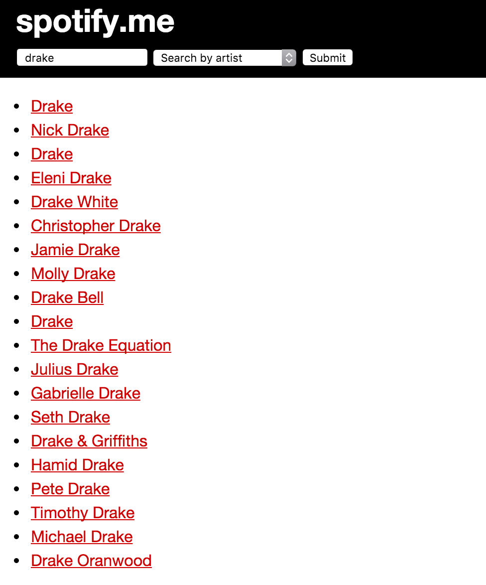

#Spotify-Me Express/AJAX Code Along
Today we're gonna build a simple Express app that consumes the [Spotify API](https://developer.spotify.com/). Here's a screen shot:





## YOU DO - Find the API Endpoints (10 min)
We have some starter code for you, but first, let's checkout the [Spotify API Documentation](https://developer.spotify.com/). We want the ability to search by artist or track name. Read through the API documentation and find the 2 endpoints we'll need. 

You can test them out by pasting them directly into your browser's URL bar, by making a cURL request in the Terminal, or by using Insomnia. You should see a crazy looking JSON object. 

## Code Along

Clone the `starter-code` and `npm install`. Open the repo in Sublime. Take a look at the `public/javascripts/script.js` file. 

Note that we have the Spotify endpoints to search by either artist and track. Try pasting these into your browser with a keyword and see what's returned. Eventually we're gonna use string concatenation to create one flexible endpoint.

Note that the jQuery library is already included. We also have a handy drop-down menu in our HTML.

### Create an Event Handler

We need to create an event handler for our submit button. Let's first get it working with an alert and wrap it in a `$(document).ready({});` function.
>remember the shorthand for this?

```js
$(function() {
  $('form#search input[type=submit]').on("click", function(event){
    event.preventDefault;
    alert("Click Event Working");
  });
});
```

What does `event.preventDefault()` mean?

>(From W3 Schools) The `event.preventDefault()` method stops the default action of an element from happening.
	
For example, `event.preventDefault()` will prevent a submit button from submitting a form or prevent a link from following the URL. In this case, we're preventing the submit button from reloading the page.


###Create a `searchSpotify` function

We'll write two functions, one to make the Spotify API request the results and one to display the results. Here are the basics:

```js
function searchSpotify(event) {
  event.preventDefault(); 

}

function displayResults() {
 
}
```


Let's make `searchSpotify` the callback function in our event handler.

```js
$(function() {
  $('form#search input[type=submit]').on("click", searchSpotify);
});
```

### Capture the User Input in the `searchSpotify` function
Inside our `searchSpotify` function, let's capture what the user wants to search for using jQuery and assign it to a variable. We'll also `console.log` the variable to confirm it's working:

```js
var $term = $("#search-keyword").val();
console.log($term);
```

We also want to capture the value of the user's dropdown menu selection. Let's assign it to a variable and add it to our `console.log`:

```js
var $searchType = $("#search-type").val();
console.log($term, $searchType);
```

### Use AJAX to ping the API
Take a close look at our two Spotify URLs. What is the difference between them? Let's use string concatenation to DRY up the URLs and combine them into one.

```js
var url = 'https://api.spotify.com/v1/search?q=' + $term + '&type=' + $searchType
```

Let's use `ajax` to ping the API:

```js
 $.ajax({
    url: url,
    method: "GET"
  }).done(function(data) {
    var resultsProperty = $searchType + "s";
    var results = data[resultsProperty]["items"]
    displayResults(results);
    console.log(results);
  });
```

So, what's going on here? First, we're using AJAX to call our `url` using a `GET` request. We're also passing the returning data object into our `.done()` method. 

Why are we adding an "s" to the searchType? 
>Check out the data that's returned and you'll notice that the data object has keys for either "artists" or "tracks". Our `searchType` is singular, therefore we need to concatenate an "s" to the end.

Next, we assign the specific `artists` or `tracks` array to the variable `results`. We then pass `results` into `displayResults` as a argument (we'll add the argument in the next section).

>BONUS... How could we accomplish this using `$.get`?

```js
$.get(url).done(function(data) {
    var resultsProperty = $searchType + "s";
    displayResults(data[resultsProperty]);
    console.log(data);
  }); 
```

### Here's the completed `searchSpotify` function:

```javascript
function searchSpotify(event) {
  event.preventDefault(); 
  
  var $term = $("#search-keyword").val();
  var $searchType = $("#search-type").val();

  var url = 'https://api.spotify.com/v1/search?q=' + $term + '&type=' + $searchType
  console.log($term, $searchType, url);

  $.ajax({
    url: url,
    method: "GET"
  }).done(function(data) {
    var resultsProperty = $searchType + "s";
    var results = data[resultsProperty]["items"]
    displayResults(results);
    console.log(results);
  });
}
```

### Complete the `displayResults` function

Above we passed `results` into our function as an argument. So let's add the ability to pass an argument into our function:

```js
function displayResults(results) {
  
}
```

Where in the DOM do we want to insert our results? Let's create new `<li>` elements within the `<ul id="results">` element. We'll use jQuery to create an object of that element and assign it to a variable. We're also gonna use `.empty()` on the container. Why?

>If we don't, each search result will append to the bottom of the current results div.

```js
function displayResults(results) {
  var $container = $("#results");
  $container.empty();  
}
```

11) Let's loop over each result in our results array and confirm it's working with a `console.log`:

```js
function displayResults(results) {
  var $container = $("#results");
  $container.empty();
  results.forEach(function(result) {
    console.log(result);
  })
}
```

12) Now let's actually `append()` each result to our container as a link (so the user will be directed to Spotify in a new tab):

```js
function displayResults(results) {
  var $container = $("#results");
  console.log(results.items);
  $container.empty();
  results.items.forEach(function(result) {
    $container.append("<li><a href='" + result.external_urls.spotify + "' target='_blank'>" + result.name + "</a></li>");
  })
}
```

### Check out the `solution` branch for a completed version.

##BONUS

- Try adding a Spotify search for genre, album, etc.
- Try using pagination to limit the results that are shown on the page at one time (e.g.- maybe only show 10 results at a time).
- Add some logic in case the search term doesn't exist or is misspelled.
